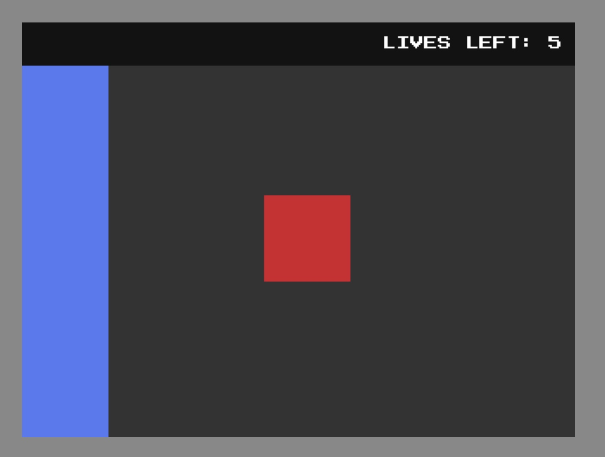

**Status:** WIP!

HV2D is a basic HTML5 2D game engine as an exercise, but also me trying to develop a game engine for my own use.



### Goals

The focus of this engine is to enable the developer to develop 2D games for the browser with ease. The intention is to
not make the next great HTML5 2D game engine but just to make a game engine I'd like to use and maybe others would like
to use as well.

### Capabilities

- Collision detection (circle and rect)
- Basic dialogue box
- Basic text on screen
- Flashing text
- Custom fonts
- Keyboard abstraction
- 

### Plugins

Plugins are capabilities given to the scenes.

- Mouse^^
- Keyboard^^
- Gamepad (controllers)
- Audio^
- UI^
- Storage^
- Dialogue^
- Sprites^^
- Touch

[^] Loaded by default if no plugins are specified

[^^] Required

### Project Setup

To set up, add this repository to your project and name it something like `engine`. In your projects `index.html` file,
include the `init.js` file...

```html

<script async type="text/javascript" src="engine/init.js"></script>
```

Create a `project.js` file.

Create a `scenes` directory in your project. Add scenes to your game by creating files in this directory like `your_scene.js`.

In `project.js`, define a game, and provide your scene list. Optionally, provide it with a second array that includes your
plugins.

```js
let myGame = new Game({
	// The first member in the array is the first scene loaded
	scenes: [
		"scene1"
	],
	// Plugins to load, overrides default plugins
	plugins: [
		"keyboard",
		"mouse",
		"audio",
		"dialogue",
		"ui"
	],
	// more configs like font, background, etc...
});
```

This will prompt the engine to load your first scene once it is ready. In your scene files is where you tell the engine
what you want it to do. You can load other scenes, create sprites, and more!
